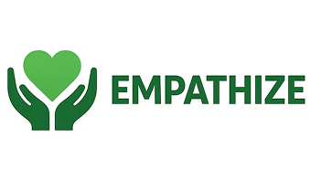

<!-- ```sh
Utilize o site <https://www.toptal.com/developers/gitignore> para gerar seu arquivo gitignore e apague este campo.

Vide tutoriais do PI.
```
-->
# FECAP - Fundação de Comércio Álvares Penteado

<p align="center">
<a href= "https://www.fecap.br/"></a>
</p>

# Empathize System

## Acoplados

## Integrantes: <a href="https://github.com/GDiniz12">Gabriel Diniz</a>, <a href="https://github.com/GianLemes">Gian Lemes</a>, <a href="https://github.com/leticia19silva">Leticia Rodrigues</a>, <a href="https://github.com/saidsales">Said Sales</a>.

## Professores Orientadores:<br><a href="https://www.linkedin.com/">Francisco de Souza Escobar</a>,<br> <a href="https://www.linkedin.com/">Cristina Machado Correa Leite</a>,<br> <a href="https://www.linkedin.com/">Katia Milani Lara Bossi</a>,<br> <a href="https://www.linkedin.com/">Leonardo Fabris Lugoboni</a>,<br><a href="https://www.linkedin.com/in/dolemes/">David De Oliveira Lemes</a>.

## Descrição

<p align="center">
<br>
  Feito por: <a href="https://github.com/2025-2-MCC2/Projeto4">Acoplados</a> <a rel="license" href="https://creativecommons.org/licenses/by-sa/3.0/">CC BY-SA 3.0</a>
</p>


De um a dois parágrafos sobre o que é seu projeto e o que ele faz.
<br><br>
Meu projeto ajuda estudantes FECAP a configurarem seus githubs.
<br><br>
May the force be with you!
<br><br>

## 🛠 Estrutura de pastas

-Raiz<br>
|-->documentos<br>
  &emsp;|Entrega 1<br>
  &emsp;|Entrega 2<br>
|-->executáveis<br>
  &emsp;|-->HTML<br>
|-->imagens<br>
|-->src<br>
  &emsp;|-->Backend<br>
  &emsp;|-->Frontend<br>
|readme.md<br>
<!--
A pasta raiz contem dois arquivos que devem ser alterados:

Há 4 pastas que seguem da seguinte forma:

<b>documentos</b>: Toda a documentação estará nesta pasta.

<b>executáveis</b>: Binários e executáveis do projeto devem estar nesta pasta.

<b>imagens</b>: Imagens do sistema

<b>src</b>: Pasta que contém o código fonte.
-->
## 🛠 Instalação

<b>HTML:</b>

Não há instalação!
Encontre o index.html na pasta executáveis e execute-o como uma página WEB (através de algum browser).

## 💻 Configuração para Desenvolvimento

## 📋 Licença/License
Utilize o link <a href = "https://chooser-beta.creativecommons.org/">Licença </a> para fazer uma licença CC BY 4.0.

## 🎓 Referências

Aqui estão as referências usadas no projeto.
